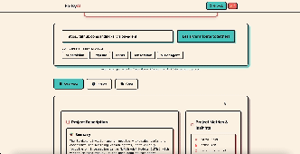

# Forky: Your AI code Companion

🌟 Powered by Google Cloud credits through the #VertexAISprint program and developed in the RevolutionUC Hackathon! ✨

[](https://forky-364607428894.us-central1.run.app/)

Forky helps open-source contributors navigate repos, understand code, and improve pull requests with real-time AI magic powered by Gemini 2.0. Ask questions, get instant PR insights, and receive smart suggestions—all while using RAG, and AI agents to make contributing faster, easier, and way more fun!

🚀 [Try it out!](https://forky-364607428894.us-central1.run.app/)

## 📦 Prerequisites

- Python 3.8 or higher
- pip package manager
- Virtual environment (recommended)
- Google Cloud credentials (for Gemini AI features)

## 🛠️ Installation & Setup

1. Clone the repository:

   ```bash
   git clone https://github.com/yourusername/forky.git
   cd forky
   ```

2. Set up virtual environment:

   ```bash
   python -m venv .venv
   source .venv/bin/activate  # On Windows: .venv\Scripts\activate
   ```

3. Install dependencies:

   ```bash
   pip install -r requirements.txt
   ```

4. Environment configuration:
   - Copy `.env.example` to `.env`
   - Add your Google Cloud credentials and other required environment variables

## 🚀 Running the Application

### Local Development

```bash
cd src/
python -m uvicorn server.main:app --reload
```

The application will be available at `http://localhost:8000`

### Production Deployment

```bash
cd src/
python -m uvicorn server.main:app --host 0.0.0.0 --port 8000
```

## 🎯 Core Features

### Repository Analysis

- **Code Understanding**: AI-powered code explanation and architecture insights
- **Dependency Visualization**: Interactive visualization of code dependencies
- **Repository Structure Analysis**: Clear breakdown of codebase organization

### Pull Request Assistant

- **Automated Reviews**: AI-driven code review suggestions
- **Quality Checks**: Automated code quality assessment
- **Best Practices**: Contextual recommendations for improvements
- **Difficulty Scoring**: PR classification (Easy/Medium/Hard)

### Interactive Features

- **Natural Language Q&A**: Ask questions about any code segment
- **Real-time Suggestions**: Context-aware coding recommendations
- **Multi-language Support**: Works across different programming languages

## 🏗️ Project Structure

```plaintext
forky/
├── src/                    # Main source code
│   ├── server/            # Backend server implementation
│   │   ├── ai/           # AI/ML models and Gemini integration
│   │   ├── routers/      # FastAPI route handlers
│   │   ├── templates/    # Jinja2 HTML templates
│   │   ├── main.py      # Application entry point
│   │   └── server_utils.py # Utility functions
│   ├── static/           # Static assets
│   │   ├── css/         # Tailwind CSS styles
│   │   └── js/          # Frontend JavaScript
│   ├── diagrams/        # Visualization components
│   └── config.py        # Configuration settings
├── docs/                 # Documentation
├── tests/               # Test suite
└── docker/              # Docker configuration
```

## 🛠️ Technology Stack

### Backend

- **FastAPI**: High-performance web framework
- **Gemini 2.0**: Google's advanced AI model
- **PyViz**: Data visualization library
- **gitingest**: Git repository analysis tool

### Frontend

- **Tailwind CSS**: Utility-first CSS framework
- **Jinja2**: Template engine
- **JavaScript**: Interactive features

### DevOps & Tools

- **Docker**: Containerization
- **uvicorn**: ASGI server
- **PostHog**: Analytics platform

## 🐳 Docker Deployment

1. Build the image:

   ```bash
   docker build -t forky .
   ```

2. Run the container:

   ```bash
   # Development
   docker run --env-file .env -d --name forky -p 8080:8080 forky

   # Production
   docker run -d --name forky -p 8080:8080 forky
   ```

## 🔧 Configuration

### Environment Variables

- `GOOGLE_API_KEY`: Your Google Cloud API key
- `ALLOWED_HOSTS`: Comma-separated list of allowed hosts

   ```bash
   # Default: "forky.com,*.forky.com,localhost,127.0.0.1"
   ALLOWED_HOSTS="example.com,localhost,127.0.0.1"
   ```

## 🤝 Contributing

We welcome contributions! Please see our [Contributing Guidelines](CONTRIBUTING.md) for details.

## 📄 License

This project is licensed under the MIT License - see the [LICENSE](LICENSE) file for details.

## 🙏 Acknowledgments

- Google Cloud for providing credits through #VertexAISprint
- RevolutionUC Hackathon for the platform
- All our contributors and supporters
